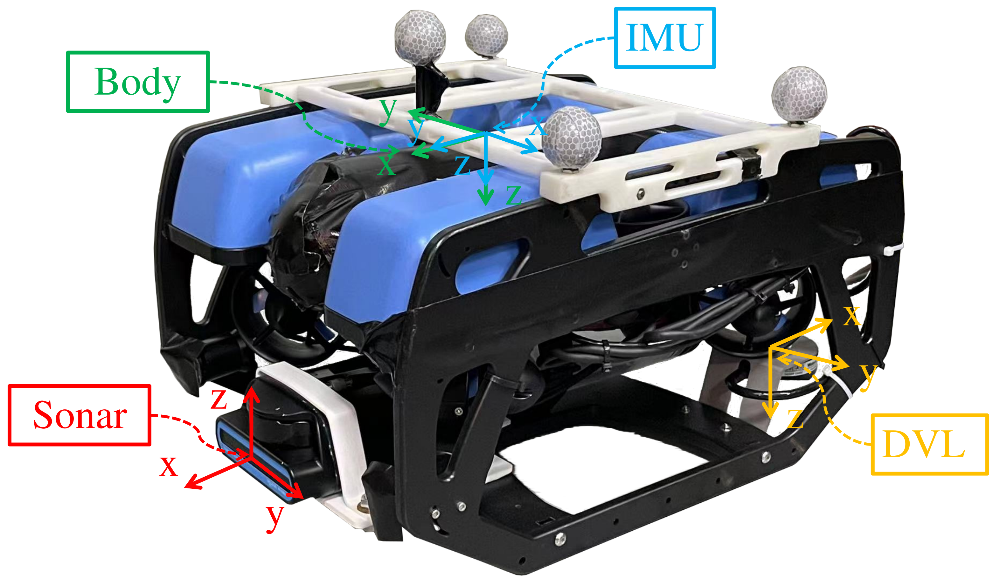
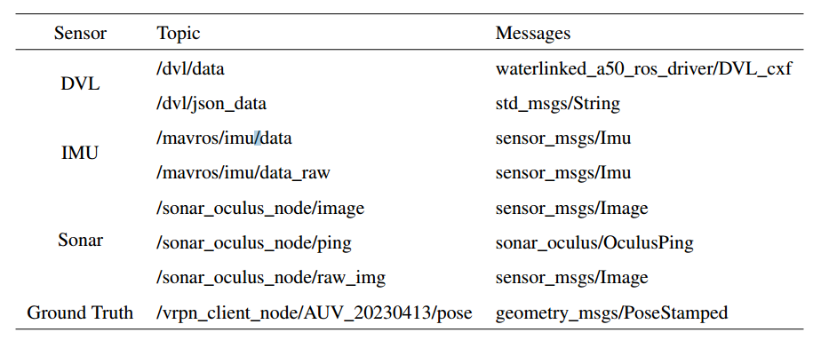

# Sonar_Based_UUV_DataSet
An underwater data set based on the indoor collection of the underwater robot BlueROV2 is released.
We presents a novel dataset obtained from a BlueROV underwater vehicle in an indoor tank for the research of underwater perception, featuring ground-truth pose trajectories obtained from a motion capture system. In particular, we teleoperated the BlueROV and recorded readings from various sensors at $10$--$100$~Hz, including a high-resolution multibeam imaging sonar, an inertial measurement unit, and a Doppler velocity log (which also provides depth measurements). In addition, the underwater motion capture system provided the ground-truth trajectories of the BlueROV at $53$~Hz, which is the key enabler to effectively quantify the performance of underwater simultaneous localization and mapping (SLAM) algorithms. The sensor modules are synchronized via the Robot Operating System, which is sufficient for the motions in underwater scenarios. Finally, an example is given of an underwater SLAM algorithm being tested on the collected data. The dataset can be found at [Sonar Based UUV DataSet](https://drive.google.com/drive/folders/1bmXsoU87pRhK27qmpm_y9V35O_G1HwC3?usp=sharing).

## Experimental equipment
1. BlueROV
The underwater robot BlueROV is equipped with an underwater imaging sonar, an IMU, a depth sensor, a DVL, and a set of reflective markers.

2. Experiment tank
An indoor tank of size 6.7 m × 3.5 m × 1.2 m, populated with some blue boxes of various sizes as obstacles. One obstacle example is highlighted by the green rectangle, the size of this obstacle is 0.31 m × 0.295 m × 0.9 m. One of the 12 cameras is highlighted by a red rectangle.

## Data description
All sensor readings obtained along a trajectory are stored in a single ROS bag file , named \textit{trajectory.bag}, where \textit{trajectory} is the placeholder for the trajectory choice from ''circle'', ''line'', and ''L-shape''. The ROS bag file contains synchronized messages from all sensors. The topics and message types corresponding to each type of data are shown in following table.

